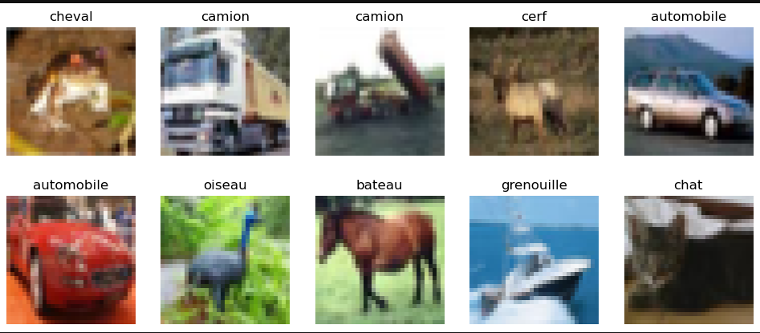
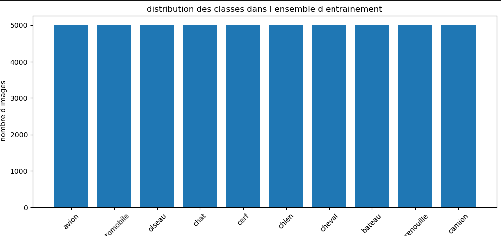
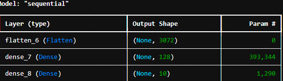
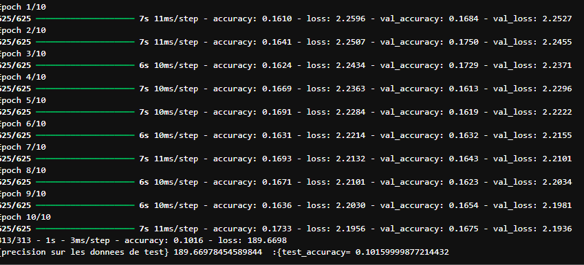
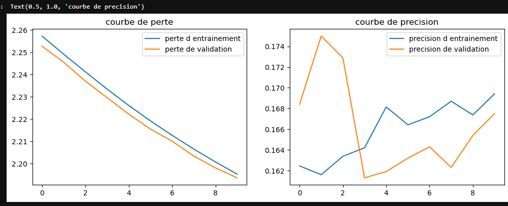

# MLP
apprentissage profond et analyse avec le perceptron multi-couche(deep learning)

dependances
`tensorflow`
`matplotlib`
`nympy`
`keras`

## Prerequis
Connaissance du calcul matriciel, algèbre lineaire, vectorialisation etc.

##  charger les données
```python
from tensorflow.keras.datasets import cifar10
(x_train,y_train),(x_test,y_test)= cifar10.load_data()
import tensorflow as tf 
from tensorflow import keras
import matplotlib.pyplot as plt
import numpy
from tensorflow.keras.datasets import cifar10
from tensorflow.keras.utils import to_categorical
class_cifar=10
cifar_classes=["avion","automobile","oiseau","chat","cerf","chien","cheval","bateau","grenouille","camion"]

 #Afficher la forme des ensembles d entrainement et des test 
print("forme de l ensemble d entrainement (images):",x_train.shape)
print("forme de l ensemble d entrainement(etiquettes):",y_train.shape)
print("forme de l ensemble d entrainement (images):",x_test.shape)
print("forme de l ensemble d entrainement(etiquettes):",y_test.shape)
```
```terminal
forme de l ensemble d entrainement (images): (50000, 32, 32, 3)
forme de l ensemble d entrainement(etiquettes): (50000, 1)
forme de l ensemble d entrainement (images): (10000, 32, 32, 3)
forme de l ensemble d entrainement(etiquettes): (10000, 1)
```
## affiher quelque exemple d images avec leur etiquettes
```python
plt.figure(figsize=(12,5))
for i in range(10):
    plt.subplot(2,5,i+1)
    plt.imshow(x_train[i])
    plt.title(cifar_classes[y_train[i][0]])
    plt.axis("off")
plt.show()
```


## afficher la distribution des classes dans l ensemble d entrainement 
```python
import matplotlib.pyplot as plt
class_distribution=[0] * 10
for label in y_train:
    class_distribution[label[0]] +=1

plt.figure(figsize=(12, 5))
plt.bar(cifar_classes,class_distribution)
plt.title("distribution des classes dans l ensemble d entrainement")
plt.xlabel("classes")
plt.ylabel(" nombre d images")
plt.xticks(rotation=45)
plt.show()
```


# pretraitement des donnees
## nomalisation des pixel des image en mettant a l echelle entre 0 et 1
```python
x_train=x_train.astype("float32")/255.0
x_test=x_test.astype("float32")/255.0
```
## transformation des etiquette en vecteur one-hot(encodage categoriser)
```python
num_classes=10
y_train=tf.keras.utils.to_categorical(y_train,num_classes)
y_test=tf.keras.utils.to_categorical(y_test,num_classes)
```
## afficher les dimension apres le pretraitement

```python
print("forme de l ensemble d entrainement(image):",x_train. shape)
print("forme de l ensemble de test(image):",x_test.shape)
print("forme de l ensemble d entrainement(etiqette):",y_train.shape)
print("forme de l ensemble de test(etiqette):",y_test.shape)
```
```terminal
forme de l ensemble d entrainement(image): (50000, 32, 32, 3)
forme de l ensemble de test(image): (10000, 32, 32, 3)
forme de l ensemble d entrainement(etiqette): (50000, 10)
forme de l ensemble de test(etiqette): (10000, 10)
```
# 4.MODEL MLP
## 4.1 CONSTRUCTION DU MODEL

```python
import tensorflow as tf 
import numpy as np
from tensorflow  import keras
from tensorflow.keras import layers
from tensorflow.keras.layers import Flatten
from tensorflow.keras.layers import Dense
from tensorflow.keras.models import Sequential

##definition du model mlp pour la classification d image
model_mlp=keras.Sequential([  
   layers.Flatten(input_shape=(32,32,3)),#3:RVB
    layers.Dense(128, activation='relu'),
    layers.Dense(10, activation='softmax')
    
    #ajouter une couche cachee de 238 neurones avec une fonctions
    #Ajouter une couche de sortis avec 10 neurone
])

#compile le model predictif avec une fonction de perte, une fonction d optimisation
model_mlp.compile(optimizer="adam",
                  loss= "categorical_crossentropy",
                  metrics=["accuracy"])

#afficher un resume du model pour obtenir un resumer de information 
model_mlp.summary()
```
```terminal
Model: "sequential"
```


```terminal
Total params: 394,634 (1.51 MB)
 Trainable params: 394,634 (1.51 MB)
 Non-trainable params: 0 (0.00 B)
 ```

 ```python
 #entrainer le model mlp sur les donnees d entrainement
epochs=200 #nombre d epoque
batch_size=32 #Taille du batch

#utilisation de la validation split(0.2 DES DONNEEE POUR LA VALIDATION)
historique= model_mlp.fit(x_train,y_train,epochs=10,batch_size=64, validation_split=0.2)
#evaluation du model sur les donne test
test_loss,test_accuracy=model_mlp.evaluate(x_test,y_test,verbose=2)
#afficher les pecision du model sur les donnees test 
print("{precision sur les donnees de test}", test_loss/100, " :{test_accuracy=", test_accuracy)
```


```python
#affiche les courbe d apprentissage (perte et precision)
plt.figure(figsize=(12,4))
plt.subplot(1,2,1)
plt.plot(historique.history["loss"], label= "perte d entrainement")
plt.plot(historique.history["val_loss"], label= "perte de validation")
plt.legend()
plt.title("courbe de perte")

plt.subplot(1,2,2)
plt.plot(historique.history["accuracy"], label= "precision d entrainement")
plt.plot(historique.history["val_accuracy"], label= "precision de validation")
plt.legend()
plt.title("courbe de precision")
```


